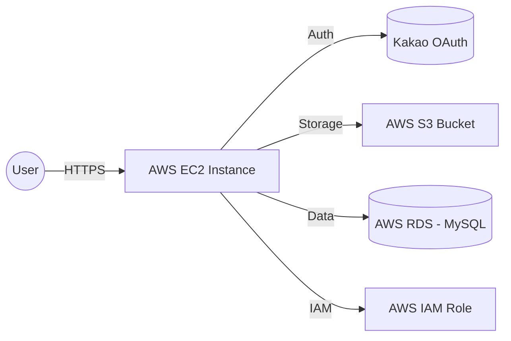

# ⚾️ Y.P.T (Ya-P-T) - BE
> **야구(Yagu)와 아파트(APT)의 만남, 야구 팬들의 즐거운 '우리 집' 같은 공간**

Y.P.T는 로제의 '아파트(APT.)' 트렌드에서 영감을 받아 기획된 프로젝트로, 야구 팬들의 열정적인 기록과 소통을 위한 '디지털 아파트' 역할을 합니다. 백엔드 시스템은 이 '아파트'의 튼튼한 기반이 되어 사용자 인증, 데이터 영속성 관리 및 대용량 이미지 처리를 담당합니다.


> **Spring Boot 기반의 안정적인 야구 팬 커뮤니티 백엔드 시스템**

Y.P.T 백엔드는 사용자 인증, 데이터 영속성 관리, 대용량 이미지 처리 및 서드파티 API 연동을 담당하는 핵심 엔진입니다. AWS 클라우드 인프라를 활용하여 확장성 있는 서비스를 구축했으며, JWT와 Spring Security를 통한 엔터프라이즈급 보안을 지향합니다.

---

## 🛠 Tech Stack

- **Lanuage & Framework**: Java 17, Spring Boot 3.3.x
- **Security**: Spring Security, JWT (JSON Web Token)
- **Database**: MySQL (AWS RDS), Spring Data JPA
- **Cloud Infrastructure**: **AWS (EC2, S3, RDS, IAM)**
- **OAuth**: Kakao Login API 연동
- **API Docs**: SpringDoc OpenAPI (Swagger UI)
- **Build Tool**: Gradle

---

## 🚀 Key Features (BE Focus)

### 1. Security & Authentication (보안 및 인증)
- **JWT 기반 무상태(Stateless) 인증**: `JwtFilter`와 `JwtUtil`을 커스텀 구현하여 토큰 기반의 안전한 인증 환경을 구축했습니다.
- **Spring Security**: 보안 설정을 통해 역할 기반의 접근 제어(RBAC) 및 CORS 정책을 중앙 집중식으로 관리합니다.

### 2. AWS S3 Media Handling (미디어 처리)
- **S3 Service**: 직관 일지의 사진 업로드 및 사용자 프로필 이미지 처리를 위해 `aws-java-sdk-s3`를 연동했습니다.
- **IAM Role**: 환경 변수를 통한 접근이 아닌 **EC2 IAM Role** 기반의 권한 관리를 통해 보안성을 강화했습니다.

### 3. Kakao OAuth Integration (서드파티 연동)
- **외부 API 통신**: `WebClient`를 활용하여 카카오 인증 서버와 통신하고, 액세스 토큰 획득 및 유저 정보 매핑 로직을 추상화했습니다.

---

## 🌐 Infrastructure & Deployment

서비스의 안정적인 운영을 위해 AWS 클라우드 생태계를 적극 활용했습니다.

### System Architecture


- **Server**: AWS EC2 (Ubuntu 22.04 LTS)
- **Database**: **AWS RDS (MySQL 8.x)** - 데이터 가용성 및 확장성 확보
- **Deployment**: `Gradle`을 활용한 빌드 최적화 및 `.jar` 실행 환경 구축
- **Storage**: AWS S3를 활용한 정적 리소스(이미지) 관리

---

## 🏗 CI/CD Pipeline

서비스의 지속적 통합 및 배포를 위해 GitHub Actions를 활용한 자동화 파이프라인을 구축했습니다.

### Deployment Workflow
1.  **CI (Continuous Integration)**: 
    - `main` 또는 `develop` 브랜치에 코드가 푸쉬되면 GitHub Actions가 트리거됩니다.
    - **Gradle Build**: 코드를 빌드하고 테스트를 수행하여 무결성을 검증합니다.
2.  **CD (Continuous Deployment)**:
    - 빌드가 성공하면 `.jar` 파일을 생성합니다.
    - **Deployment**: SCP 또는 외부 라이브러리를 통해 EC2 인스턴스로 빌드 파일을 전송하거나, Docker 이미지를 통한 무중단 배포 환경을 지원합니다. (프로젝트 설정에 따라 다름)

---

## 📁 Project Architecture

```text
java/com/baseballweb/auth/
├── config/          # Security, Web, S3 등 전역 설정
├── controller/      # REST API 엔드포인트 설계
├── service/         # 비즈니스 로직 및 트랜잭션 관리
├── repository/      # Spring Data JPA를 이용한 데이터 접근
├── model/           # Entity 정의 (Domain)
├── dto/             # 계층 간 데이터 전송을 위한 객체
└── jwt/             # 토큰 생성 및 필터링 핵심 로직
```

---

## 💡 Technical Excellence (Interview Point)

### ✔️ 확장 가능한 이미지 업로드 설계
단순 업로드를 넘어, `S3Service`를 인터페이스화하여 향후 로컬 저장소나 다른 클라우드(GCP, Azure)로 쉽게 교체할 수 있도록 확장성을 고려해 설계했습니다.

### ✔️ 클라우드 보안 최적화
Access Key 유출 위험을 방지하기 위해 **EC2 IAM Role**을 활용한 권한 할당 방식을 적용하여 인프라 보안 수준을 높였습니다.

### ✔️ Swagger UI를 통한 API 명세화
협업의 효율성을 높이기 위해 모든 API 엔드포인트에 Swagger(OpenAPI 3.0)를 적용하여 프론트엔드 개발자와의 명확한 통신 규약을 확립했습니다.